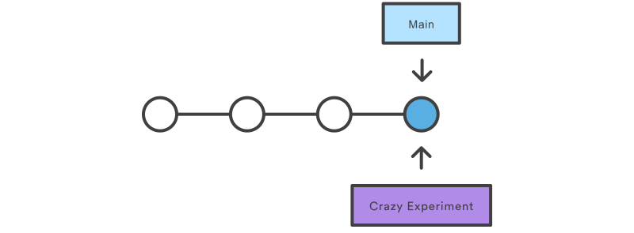

# Comando Branch

 En Git, las ramas son parte del proceso de desarrollo diario. Las ramas de Git son un puntero eficaz para las instantáneas de tus cambios. Cuando quieres añadir una nueva función o solucionar un error, independientemente de su tamaño, generas una nueva rama para alojar estos cambios. Esto hace que resulte más complicado que el código inestable se fusione con el código base principal, y te da la oportunidad de limpiar tu historial futuro antes de fusionarlo con la rama principal. veamos un ejemplo a continuación con la siguiente imagen
 
El diagrama anterior representa un repositorio con dos líneas de desarrollo aisladas, una para una función pequeña y otra para una función más extensa. Al desarrollarlas en ramas, no solo es posible trabajar con las dos de forma paralela, sino que también se evita que el código dudoso se fusione con la rama main.

# Funcionamiento

Una rama representa una línea independiente de desarrollo. Las ramas sirven como una abstracción de los procesos de cambio, preparación y confirmación. Puedes concebirlas como una forma de solicitar un nuevo directorio de trabajo, un nuevo entorno de ensayo o un nuevo historial de proyecto. Las nuevas confirmaciones se registran en el historial de la rama actual, lo que crea una bifurcación en el historial del proyecto.

El comando `git branch` te permite crear, enumerar y eliminar ramas, así como cambiar su nombre. No te permite cambiar entre ramas o volver a unir un historial bifurcado. Por este motivo, `git branch` está estrechamente integrado con los comandos git `checkout` y `git merge`.

# Creación de ramas 

Es importante comprender que las ramas son solo punteros a las confirmaciones. Cuando creas una rama, todo lo que Git tiene que hacer es crear un nuevo puntero, no modifica el repositorio de ninguna otra forma. Si empiezas con un repositorio que tiene este aspecto:

Y, a continuación, creas una rama con el siguiente comando:
`git branch crazy-experiment`
El historial del repositorio no se modificará. Todo lo que necesitas es un nuevo puntero de la confirmación actual:

Ten en cuenta que este comando solo crea la nueva rama. Para empezar a añadir confirmaciones, necesitas seleccionarla con el comando git checkout y, a continuación, utilizar los comandos estándar git add y git commit.

